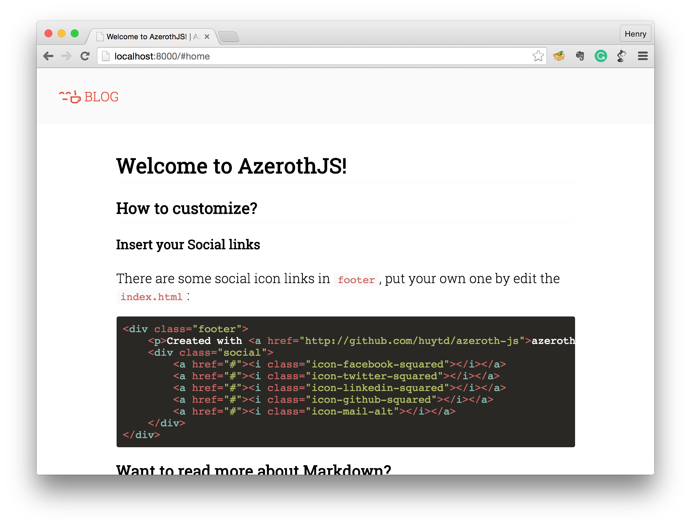

# AzerothJS

AzerothJS is an open source blog engine running on static file servers such as Github Pages or any web hosting. 

In short: 100% client-side JavaScript. 



## Live demo
Check out the [live demo here](http://huytd.github.io/azeroth-js/)

## What makes AzerothJS cool?

- Super lightweight
- No installation needed
- No server side code
- Made for Github Pages
- Easy to customization
- Static HTML Generator

## How to use?

### Run locally
1. Clone this project to your computer
2. Start simple HTTP server with Python:
  ```
  python -m SimpleHTTPServer
  ```
3. Your blog now available at [http://localhost:3000](http://localhost:3000)

### Use with Github Pages
1. Create your Github Pages
2. Clone the this project and push it to your Github Pages
3. Every time you want to write, create a new `*.md` file in `posts` folder and write with your favorite Markdown Editor
4. Modify `posts/home.md`, list your posts here
5. Commit and push everything here. Done!

### Use with other web host
1. Clone this project to your computer
2. Create a new post in `*.md` format and save to `posts` folder
3. Upload the everything to your web host
4. Done

## Two display mode
Azeroth has 2 display mode: **Live Markdown** and **Static HTML**.

If you point your browser to http://yoursite.com/#/slugged-post-name, **Live Markdown** mode will be used to render HTML content directly from Markdown file.

One problem of **Live Markdown** is: it's unable to display the content when you share the site on social networks like Facebook or Twitter. To solve this issue, we use **Static HTML**. After generating static HTML content, you can access your post at http://yoursite.com/posts/slugged-post-name

## How to generate Static HTML
Run this script in your root folder:

```
node generator.js
```

The script will automatically convert all `*.md` files in `/posts` folder to `*.html`.

Now you can list your HTML pages in `home.md` instead of markdown files.

## How to customize?

### Change code highlighting theme
The original theme for the code highlighting is `Tomorrow Night`. If you don't like it, there are many pre-installed themes inside `css/highlight` folder. Pick one and replace to `line 6` of `index.html`:

```html
<link rel="stylesheet" href="./css/highlight/tomorrow-night.css">
```

### Change the font family
The original font for the blog is `Roboto Slab`. You can change the new font by replacing `line 4` of `index.html`:

```html
<link href='https://fonts.googleapis.com/css?family=Roboto+Slab:400,300&subset=latin,vietnamese' rel='stylesheet' type='text/css'>
```

And change the font in `css/theme.css`:

```css
* {
    font-family: 'Roboto Slab', serif;
    font-size: 20px;
    font-weight: 100;
}
```

### Insert your Social links
There are some social icon links in `footer`, put your own one by edit the `index.html`:

```html
<div class="footer">
    <p>Created with <a href="http://github.com/huytd/azeroth-js">azeroth.js</a></p>
    <div class="social">
        <a href="#"><i class="icon-facebook-squared"></i></a>
        <a href="#"><i class="icon-twitter-squared"></i></a>
        <a href="#"><i class="icon-linkedin-squared"></i></a>
        <a href="#"><i class="icon-github-squared"></i></a>
        <a href="#"><i class="icon-mail-alt"></i></a>
    </div>
</div>
```

### Google Analytics

In the end of `index.html` and `template.html`, there is a line:

```js
ga('create', 'Insert-Your-GA-ID-Here', 'auto');
```

Repalce `Insert-Your-GA-ID-Here` with your Google Analytics ID to start monitoring your blog.

# License
MIT
